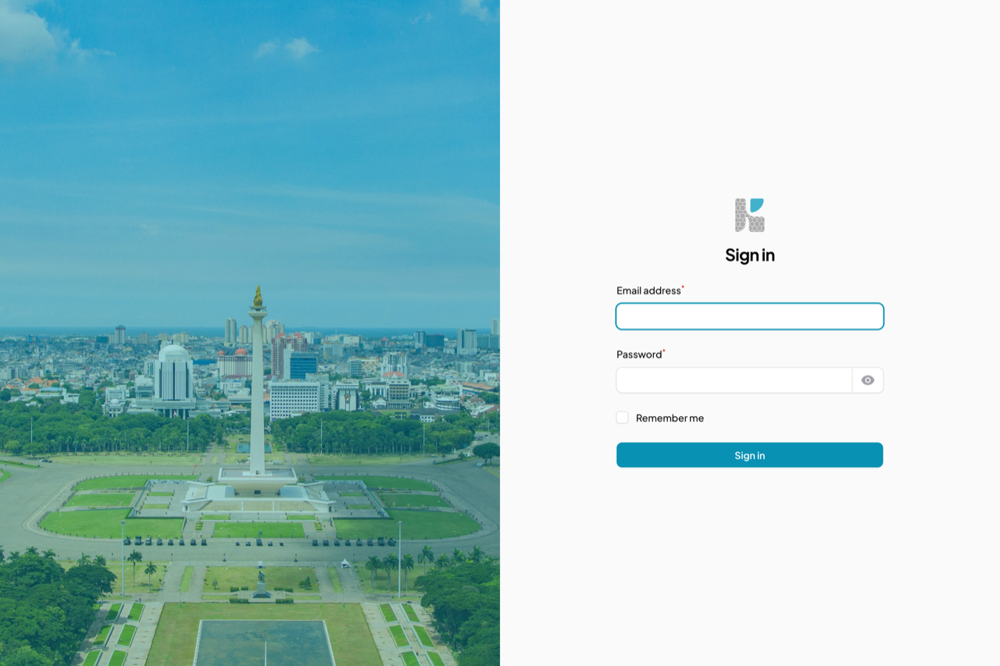
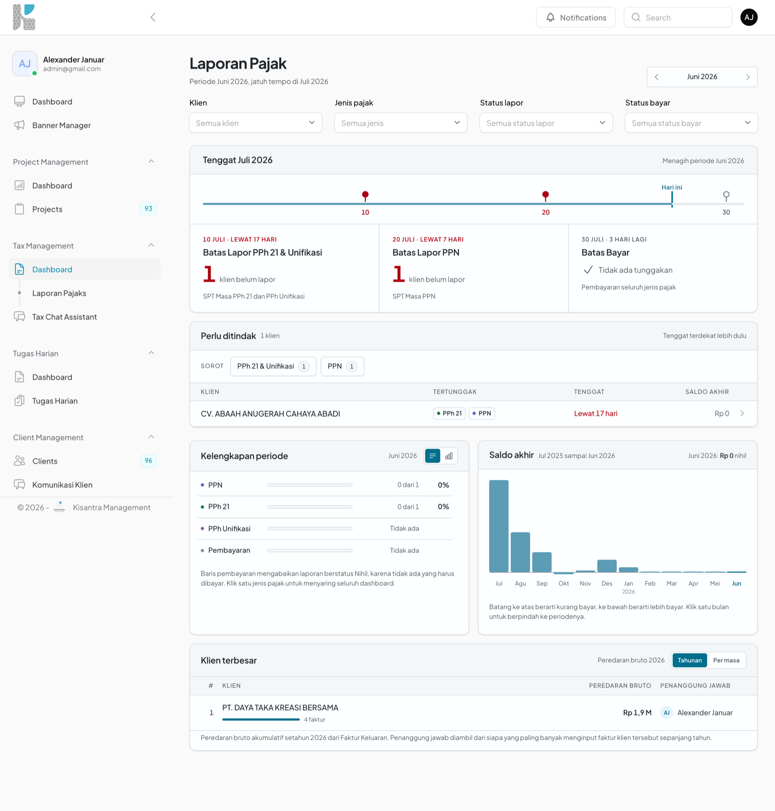
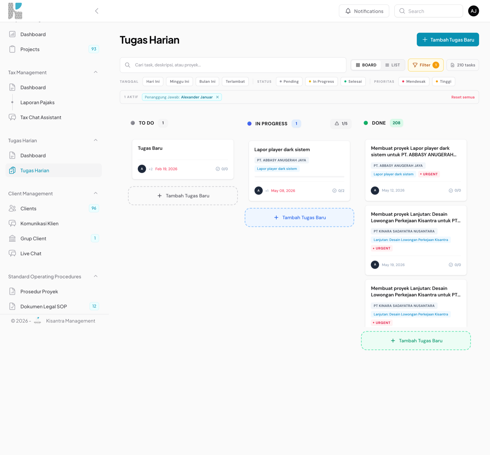
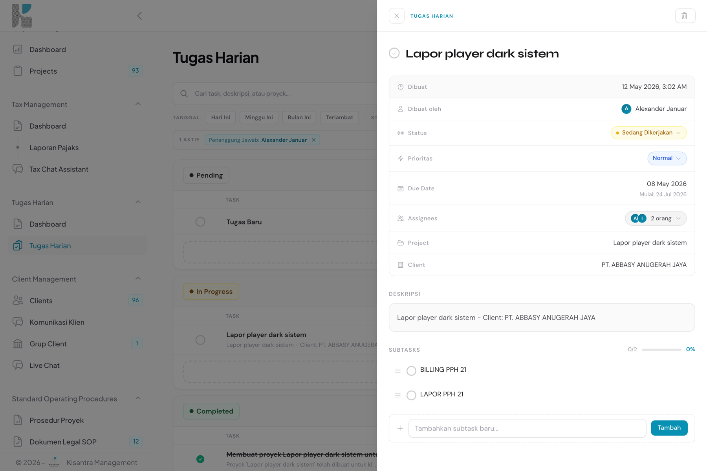
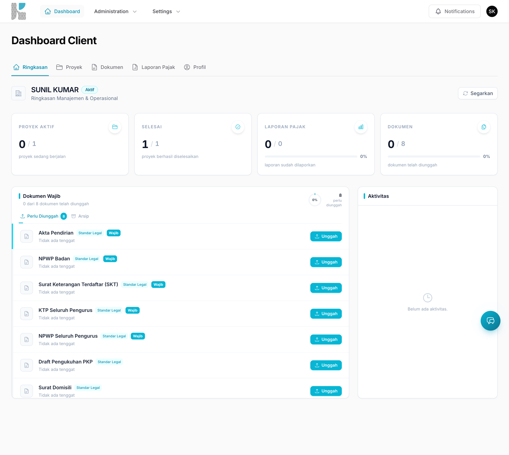
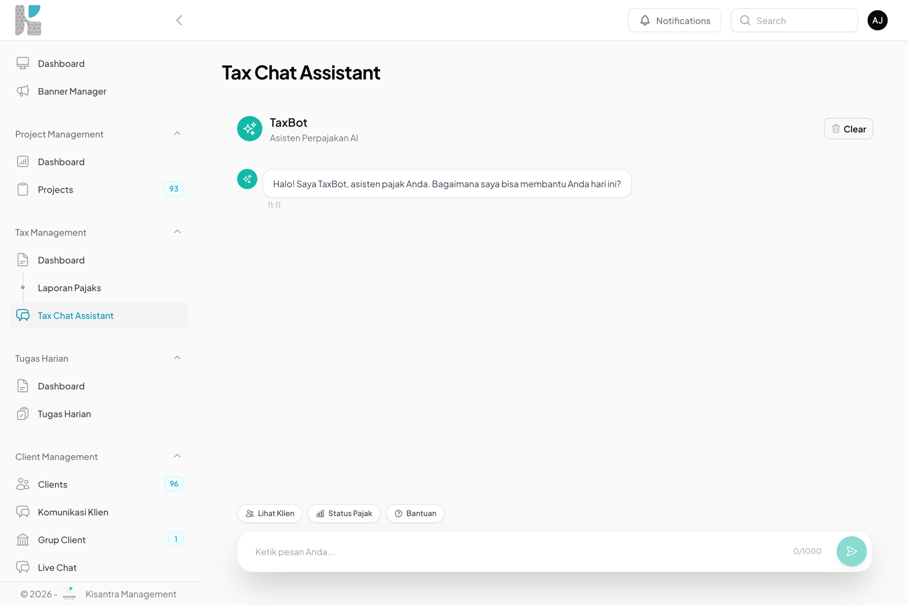

<div align="center">

<!-- PLACEHOLDER GAMBAR: logo / banner Kisantra (mis. docs/screenshots/banner.png).
     Konteks: logo aplikasi + tagline, lebar ~800px, latar terang & gelap kalau bisa. -->


# Kisantra — Project & Tax Management

**Portal admin & klien untuk konsultan pajak dan manajemen proyek di Indonesia.**
Mengelola klien, proyek, tugas harian, SOP, dan pelaporan pajak (PPh, PPN, PPh Unifikasi/Bupot, Faktur Pajak) dalam satu tempat.

<br />


</div>

---

## Daftar Isi

- [Tentang Proyek](#tentang-proyek)
- [Cuplikan Layar](#cuplikan-layar)
- [Fitur Utama](#fitur-utama)
- [Teknologi](#teknologi)
- [Arsitektur Singkat](#arsitektur-singkat)
- [Memulai](#memulai)
- [Menjalankan Aplikasi](#menjalankan-aplikasi)
- [Struktur Proyek](#struktur-proyek)
- [Deployment](#deployment)
- [Lisensi](#lisensi)

---

## Tentang Proyek

**Kisantra** (`APP_NAME=Kisantra-ProjectManagement`) adalah aplikasi web internal untuk konsultan **pajak & manajemen proyek** di Indonesia. Aplikasi ini menyatukan pekerjaan sehari-hari tim konsultan — dari mengelola klien dan proyek, menugaskan pekerjaan harian, menyusun SOP, sampai memantau kepatuhan pelaporan pajak per masa — sekaligus memberi klien portal mandiri untuk melihat progres dan berkomunikasi.

Aplikasi bersifat **dwibahasa**: antarmuka dan pesan aktivitas memakai **Bahasa Indonesia**, sedangkan identifier kode memakai **Bahasa Inggris**.

Domain pajak yang didukung mencakup:

- **PPh** — Pajak Penghasilan (mis. PPh 21)
- **PPN** — Pajak Pertambahan Nilai
- **PPh Unifikasi / Bupot** — bukti potong / withholding
- **Faktur Pajak / Invoice** — Faktur Keluaran & Masukan
- **SPT Masa** — status lapor & bayar per masa pajak

> Catatan: nama direktori repositori adalah `project-management`; nama aplikasi sesungguhnya **Kisantra**. Tidak ada kaitan dengan domain pertambangan.

---

## Cuplikan Layar

> Gambar di bawah adalah **placeholder**. Ganti berkas di `docs/screenshots/` dengan tangkapan layar sungguhan.

<!-- PLACEHOLDER: docs/screenshots/dashboard-pajak.png
     Konteks: halaman "Dashboard Laporan Pajak" (/dashboard-tax-report) — tulang punggung tenggat,
     daftar triase klien, kelengkapan periode, dan widget "Klien terbesar". -->
### Dashboard Laporan Pajak


<!-- PLACEHOLDER: docs/screenshots/tugas-harian-board.png
     Konteks: "Tugas Harian" tampilan Board (kanban) — kolom To Do / In Progress / Done. -->
### Tugas Harian — Papan (Kanban)


<!-- PLACEHOLDER: docs/screenshots/tugas-harian-list-modal.png
     Konteks: "Tugas Harian" tampilan List (dikelompokkan per status) + modal detail tugas
     (status, prioritas, assignee, subtask dengan drag-and-drop, komentar & aktivitas). -->
### Tugas Harian — Daftar & Detail Tugas


<!-- PLACEHOLDER: docs/screenshots/portal-klien.png
     Konteks: panel klien (/klien) — tampilan self-service untuk klien. -->
### Portal Klien


<!-- PLACEHOLDER: docs/screenshots/asisten-pajak-ai.png
     Konteks: halaman "Tax Chat" — asisten pajak berbasis AI (Gemini/NeuronAI). -->
### Asisten Pajak (AI)


---

## Fitur Utama

### 📁 Manajemen Proyek
- CRUD **Klien**, **Proyek**, **Langkah Proyek (Project Step)**, dan **Tugas**.
- Alur dokumen: **Required Document** → **Submitted Document** dengan rantai persetujuan.
- Status proyek otomatis menyinkronkan tugas harian terkait.
- Dashboard proyek & halaman detail proyek.

### 🧾 Manajemen Pajak
- **Laporan Pajak (TaxReport)** bulanan per klien beserta anak-anaknya: Faktur/Invoice, PPh 21, PPh Unifikasi/Bupot, kompensasi, dan ringkasan perhitungan.
- **Dashboard Laporan Pajak** — tenggat lapor/bayar per masa, triase klien yang belum lapor, kelengkapan periode, dan peringkat klien menurut peredaran bruto.
- Unggah **SPT** yang otomatis mengubah status *lapor* & *bayar*.
- Penanda "tidak ada aktivitas" untuk jenis pajak kondisional (PPh Unifikasi/Badan).

### 🗓️ Tugas Harian
- Tampilan **Papan (Kanban)** dan **Daftar** yang dapat difilter (status, prioritas, penanggung jawab, proyek).
- **Subtask** dengan **drag-and-drop** untuk mengatur urutan.
- Modal detail: status, prioritas, tenggat, assignee, subtask, komentar, dan log aktivitas.

### 📚 SOP
- **SOP**, **SOP Step/Task**, **SOP Required Document**, dan **SOP Legal Document** sebagai templat prosedur kerja.

### 👥 Portal Klien
- Panel terpisah di `/klien` untuk klien melihat progres proyek & dokumen secara mandiri.

### 💬 Kolaborasi Real‑time
- **Chat** internal & komunikasi klien yang disiarkan lewat **Laravel Reverb** (WebSocket).

### 🤖 AI
- **Asisten Pajak** (Tax Chat) dan pemrosesan invoice berbantuan AI (Gemini, OpenAI, NeuronAI).

### 🔎 Audit & Keamanan
- Dua sistem log aktivitas berjalan berdampingan: **Spatie Activitylog** dan **UserActivity** kustom (via trait `Trackable`).
- Kontrol akses berbasis peran & permission (Filament Access Management).

---

## Teknologi

| Lapisan | Teknologi |
| --- | --- |
| Bahasa | PHP **8.1+** |
| Framework | **Laravel 10** |
| Panel Admin/Klien | **Filament 3.3** + **Livewire 3** |
| Basis Data | **MySQL** |
| Real‑time / WebSocket | **Laravel Reverb** (protokol Pusher) |
| Front‑end | **Tailwind CSS 3.4** + **Vite 5**, `laravel-echo`, `pusher-js` |
| Penyimpanan Berkas | **Google Drive** (`yaza/laravel-google-drive-storage`) |
| Ekspor/Impor | **Maatwebsite/Excel** |
| PDF | **barryvdh/laravel-dompdf** |
| Audit | **Spatie Activitylog**, Spatie Permission |
| AI | **Gemini** (`google-gemini-php/laravel`), **OpenAI**, **NeuronAI** |
| Antrean | Database queue (`QUEUE_CONNECTION=database`) |

---

## Arsitektur Singkat

Aplikasi memiliki **dua panel Filament**:

| Panel | Path | Pengguna | Entry point |
| --- | --- | --- | --- |
| **Admin** | `/` | Staf internal (Kisantra) | `AdminPanelProvider` |
| **Klien** | `/klien` | Klien (self-service) | `ClientPanelProvider` |

Perutean panel ditegakkan oleh `RedirectToProperPanelMiddleware` — pengguna dengan peran `client` diarahkan ke `/klien`, selebihnya ke `/`.

- **Real‑time** menggunakan Reverb (`BROADCAST_DRIVER=reverb`); event mengimplementasikan `ShouldBroadcast`.
- **Penyimpanan cloud** memakai Google Drive; unggahan berjalan asinkron melalui job pada antrean `database`.
- **AI** dipakai untuk asisten pajak dan layanan pemrosesan invoice.

> Dokumentasi tata letak folder yang lebih rinci ada di [`FOLDER_STRUCTURE.md`](FOLDER_STRUCTURE.md), dan panduan kerja untuk kontributor di [`CLAUDE.md`](CLAUDE.md).

---

## Memulai

### Prasyarat

- PHP **8.1+** (produksi berjalan di 8.3), dengan ekstensi umum Laravel (`mbstring`, `zip`, `gd`, `intl`, `bcmath`, dll.)
- **Composer 2**
- **Node.js 18+** (produksi memakai Node 22) & **npm**
- **MySQL 8**
- (Opsional, untuk fitur real‑time) server **Reverb**

### Instalasi

```bash
# 1. Klon repositori
git clone https://github.com/Kisantra/project-management.git
cd project-management

# 2. Dependensi PHP & front-end
composer install
npm install

# 3. Siapkan berkas environment
cp .env.example .env        # jika belum ada .env.example, salin dari templat internal
php artisan key:generate
```

Kemudian isi `.env` sesuai lingkungan Anda (nilai bersifat rahasia — **jangan commit `.env`**):

- **Database** — `DB_DATABASE`, `DB_USERNAME`, `DB_PASSWORD`
- **Broadcasting / Reverb** — `BROADCAST_DRIVER=reverb`, `REVERB_APP_*`
- **Google Drive** — kredensial `yaza/laravel-google-drive-storage` (`FILESYSTEM_CLOUD=google`)
- **AI** — kunci **Gemini** / **OpenAI**
- **Queue** — `QUEUE_CONNECTION=database`

```bash
# 4. Migrasi basis data
php artisan migrate

# 5. Build aset (produksi) — atau gunakan mode dev di bawah
npm run build
```

---

## Menjalankan Aplikasi

Cara termudah — jalankan semuanya sekaligus (server + antrean + log + Vite):

```bash
composer dev
```

Atau jalankan tiap layanan secara terpisah:

```bash
php artisan serve                    # HTTP server
php artisan queue:listen --tries=1   # pekerja antrean (upload Google Drive, dll.)
php artisan pail                     # tail log langsung
npm run dev                          # Vite (HMR)
php artisan reverb:start             # server WebSocket (untuk chat & notifikasi)
```

Pengujian:

```bash
./vendor/bin/phpunit
```

---

## Struktur Proyek

```
app/
├── Filament/            # Resource, page, widget (panel admin + klien)
│   ├── Resources/       # CRUD: Client, Project, TaxReport, Sop, ...
│   ├── Pages/           # Dashboard, DashboardTaxReport, DailyTask, TaxChat, ...
│   └── Client/Pages/    # Halaman panel klien
├── Livewire/            # Komponen Livewire di dalam view Filament
│   ├── Client/Panel/    # Tab panel klien (/klien)
│   ├── Client/Management/# Tab admin di halaman detail klien
│   ├── DailyTask/ TaxReport/ Dashboard/ ...
├── Models/              # Model Eloquent (Client, Project, TaxReport, DailyTask, ...)
├── Services/            # Logika bisnis (TaxDeadlineService, ChatService, ...)
├── Observers/ Jobs/ Events/
├── Neuron/              # Agen AI (TaxBotAgent)
├── Http/Middleware/     # Termasuk RedirectToProperPanelMiddleware
├── Providers/Filament/  # AdminPanelProvider + ClientPanelProvider
└── Traits/Trackable.php # Helper log aktivitas (user_activities)
database/migrations/     # Skema kumulatif (append-only)
resources/views/         # View Filament & Livewire (Blade)
routes/                  # web.php (Filament), api.php (REST v1), channels.php
```

Detail lengkap pemetaan Livewire ↔ Blade dan konvensi ada di [`FOLDER_STRUCTURE.md`](FOLDER_STRUCTURE.md).

---

## Deployment

Deploy ke produksi berjalan **otomatis** lewat **GitHub Actions** setiap `push` ke `main`:

1. **Gerbang verifikasi** — reproduksi build bersih di runner (composer install + `package:discover` + `npm ci` + `npm run build`) agar lock yang rusak gagal di CI, bukan di server.
2. **Deploy** — hanya bila gerbang hijau: SSH ke server, `git pull`, pasang dependensi, build aset, segarkan cache, dan restart antrean (lihat [`deploy.sh`](deploy.sh)).

Migrasi basis data **dijalankan manual** di server (`php artisan migrate --force`) agar perubahan skema selalu ditinjau.

---

## Lisensi

Proyek **internal & proprietary** milik **Kisantra**. Hak cipta dilindungi. Tidak untuk didistribusikan ulang tanpa izin.

<div align="center">
<sub>Dibuat untuk tim Kisantra · Laravel · Filament · Livewire</sub>
</div>
